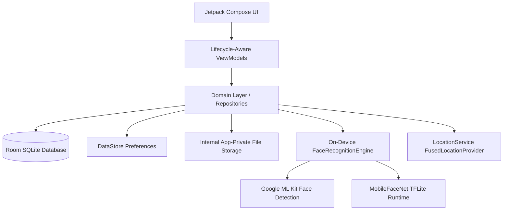

# Architecture Documentation

## 1. Architectural Philosophy

The SalaryBox Attendance application follows an **offline-first, clean architecture** pattern designed for high reliability, zero cloud dependency, and strict data privacy. Biometric and location processing is entirely on-device.

---

## 2. Layer Breakdown

### Presentation Layer (Jetpack Compose & Material 3)
* **Design System**: Strict Material 3 theme (`core/theme/Theme.kt`, `Color.kt`, `Type.kt`).
* **Navigation**: Single-activity architecture using Jetpack Navigation Compose (`core/navigation/AppNavHost.kt`) with route protection and backstack management.
* **State Management**: Unidirectional Data Flow (UDF). ViewModels expose immutable `StateFlow<UiState>` collected with lifecycle awareness (`collectAsStateWithLifecycle`).
* **Dependency Injection**: Explicit, lightweight `ServiceLocator` pattern avoiding heavy reflection or annotation-processing overhead while maintaining testability.

### Domain Layer (Business Logic & Contracts)
* **Models**: Independent domain data classes (`StaffMember`, `FaceEnrollment`, `AttendanceRecord`, `AuthSession`).
* **Repository Contracts**: Clean interfaces (`StaffRepository`, `AttendanceRepository`, `AuthRepository`) decoupling data sources from presentation logic.
* **Policy Gates**: Strict attendance validation enforcing:
  1. Valid authenticated staff session.
  2. Enrolled face template exists.
  3. Single front-facing face detected within strict pose tolerance.
  4. Normalized embedding cosine similarity $\ge 0.70$.
  5. Accurate GPS coordinates obtained within a 10-second timeout.

### Data Layer (Persistence & Hardware Services)
* **Room Database**: SQLite persistence with foreign keys (`CASCADE` delete), indices on frequent query columns (`employeeId`, `staffId`, `timestamp`), and transaction safety.
* **Session Manager**: AndroidX DataStore Preferences providing reactive, asynchronous session persistence across process restarts.
* **Internal Storage**: `InternalFileStorage` stores captured selfies and enrollment templates strictly in `context.filesDir` (app-private storage, inaccessible to other applications).
* **Location Service**: Coroutine-based wrapper around Google Play Services `FusedLocationProviderClient` with timeout and fallback logic.

---

## 3. Database Schema

### `staff` Table
* `id`: INTEGER PRIMARY KEY AUTOINCREMENT
* `employeeId`: TEXT UNIQUE NOT NULL (Indexed)
* `name`: TEXT NOT NULL
* `password`: TEXT NOT NULL (Default: "1234")
* `isActive`: INTEGER NOT NULL (Default: 1)
* `createdAt`: INTEGER NOT NULL
* `updatedAt`: INTEGER NOT NULL

### `face_enrollment` Table
* `id`: INTEGER PRIMARY KEY AUTOINCREMENT
* `staffId`: INTEGER UNIQUE NOT NULL (Foreign Key -> `staff.id` ON DELETE CASCADE)
* `embeddingData`: TEXT NOT NULL (Comma-separated 192 float values)
* `modelVersion`: TEXT NOT NULL
* `sampleCount`: INTEGER NOT NULL
* `enrolledAt`: INTEGER NOT NULL
* `imagePaths`: TEXT NOT NULL

### `attendance` Table
* `id`: INTEGER PRIMARY KEY AUTOINCREMENT
* `staffId`: INTEGER NOT NULL (Foreign Key -> `staff.id` ON DELETE CASCADE, Indexed)
* `timestamp`: INTEGER NOT NULL (Indexed)
* `selfiePath`: TEXT NOT NULL
* `latitude`: REAL NOT NULL
* `longitude`: REAL NOT NULL
* `locationAccuracy`: REAL NOT NULL
* `matchScore`: REAL NOT NULL
* `verificationStatus`: TEXT NOT NULL

---

## 4. Hardware Integrations

### CameraX & Image Analysis
* **Lens**: Front-facing camera (`CameraSelector.DEFAULT_FRONT_CAMERA`).
* **Analysis**: `ImageAnalysis.STRATEGY_KEEP_ONLY_LATEST` with an atomic non-blocking lock (`AtomicBoolean`) preventing frame queuing or UI thread starvation.
* **Capture**: `ImageCapture` configured for low-latency capture with hardware orientation correction and front-camera horizontal mirroring.
* **Lifecycle**: Bound to Compose `LocalLifecycleOwner` with safe disposal on recomposition or navigation exit.

### Location Services
* **Providers**: `Priority.PRIORITY_HIGH_ACCURACY` requesting GPS and Network location fixes.
* **Timeout**: Strict 10-second limit using `withTimeoutOrNull(10_000L)` preventing indefinite loading spinners.
* **Fallback**: Gracefully falls back to cached last-known location if current fix takes longer than timeout.
* **Address Resolution**: Background `Geocoder` reverse geocoding to human-readable address.
