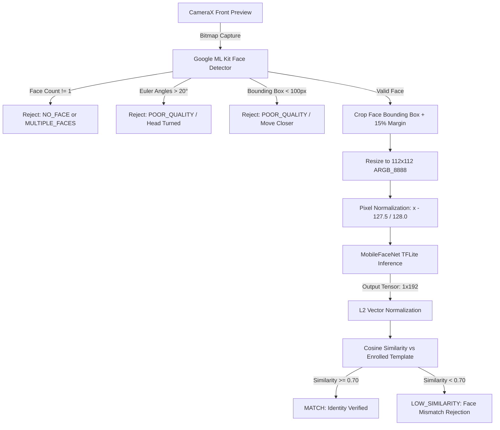

# Face Verification Pipeline Specification

This document details the on-device biometric pipeline implemented in the application, including the mathematical models, neural network inference, preprocessing steps, and verification thresholds.

---

## 1. Core Principle: Face Detection vs. Face Recognition

A critical architectural distinction is maintained throughout the system:
* **Face Detection (ML Kit)**: Answers the question: *"Is there a human face in this frame, where is it located, and is the head pose acceptable?"* It **cannot** determine *who* the person is.
* **Face Recognition (MobileFaceNet TFLite)**: Answers the question: *"Does the visual feature embedding of this face match the enrolled template vector of Staff Member X?"*

**The application never assumes face detected = user matched.**

---

## 2. End-to-End Verification Pipeline



---

## 3. Neural Network Model & Preprocessing Specs

| Attribute | Specification | Rationale |
| :--- | :--- | :--- |
| **Model Architecture** | MobileFaceNet (TensorFlow Lite) | Specifically optimized for edge devices and mobile processors. High accuracy-to-latency ratio. |
| **Model File** | `app/src/main/assets/mobilefacenet.tflite` | 5.2 MB flatbuffer bundled in application assets. |
| **Input Tensor Shape** | `[1, 112, 112, 3]` (Batch, Height, Width, Channels) | Standard input dimensions for MobileFaceNet. |
| **Input Data Type** | `Float32` (Direct ByteBuffer native byte order) | Highest precision for normalized floating point inputs. |
| **Pixel Normalization** | `(pixel_channel - 127.5f) / 128.0f` | Maps 8-bit RGB channels $[0, 255]$ to normalized range $[-1.0, 1.0]$. |
| **Output Tensor Shape** | `[1, 192]` (Batch, Embedding Dimension) | Compact 192-dimensional latent feature vector. |
| **Embedding Normalization** | L2 Normalization: $v_{norm} = \frac{v}{\max(\|v\|_2, 10^{-10})}$ | Projects embedding onto the unit hypersphere so dot product equals cosine similarity. |

---

## 4. Multi-Template Enrollment

During Admin Face Enrollment:
1. Three distinct valid face samples are captured across slight pose/expression adjustments.
2. For each sample, a normalized 192-dimensional embedding $E_i$ is computed.
3. The sample embeddings are averaged into a composite representation:
   $$\bar{E} = \frac{1}{3} \sum_{i=1}^{3} E_i$$
4. The composite representation is L2-normalized:
   $$E_{template} = \frac{\bar{E}}{\|\bar{E}\|_2}$$
5. Stored in Room database column `embeddingData` as a comma-separated float string.

---

## 5. Comparison Metric & Decision Threshold

### Cosine Similarity Formula
Between candidate vector $A$ and enrolled template vector $B$:
$$\text{Cosine Similarity} = \frac{A \cdot B}{\|A\|_2 \|B\|_2} = \sum_{k=1}^{192} A_k \cdot B_k$$

### Centralized Threshold
* Configured in `face/FaceRecognitionConfig.kt`:
  ```kotlin
  const val SIMILARITY_THRESHOLD = 0.70f
  ```
* **Decision Rule**:
  * $\text{Score} \ge 0.70 \implies$ **MATCH** (Attendance permitted if location succeeds).
  * $\text{Score} < 0.70 \implies$ **LOW_SIMILARITY** (Rejected: *"Face does not match your enrolled profile."*).

---

## 6. Pose & Quality Validation Rules

Google ML Kit evaluates head rotation before sending the image to TFLite:
* **Yaw Angle (Head turn left/right)**: Must be within $[-20^\circ, +20^\circ]$.
* **Pitch Angle (Head tilt up/down)**: Must be within $[-20^\circ, +20^\circ]$.
* **Roll Angle (Head tilt sideways)**: Must be within $[-20^\circ, +20^\circ]$.
* **Face Size**: Bounding box width $\ge 100$px and height $\ge 100$px.

---

## 7. Assumptions & Known Limitations

1. **Lighting Sensitivity**: In extreme backlighting or near-total darkness, ML Kit face detection will fail closed (`NO_FACE`).
2. **Heavy Occlusions**: Thick sunglasses or face masks will obstruct key facial landmarks, preventing embedding generation.
3. **Threshold Calibration**: The threshold ($0.70$) is tuned for mobile front cameras in practical office environments. In high-security biometric borders, paired RGB-D depth sensors or infrared liveness checks would be required to prevent printed 2D photo spoofing.
4. **Offline Operation**: Model execution is 100% on-device; no internet connection is ever required for face recognition.
